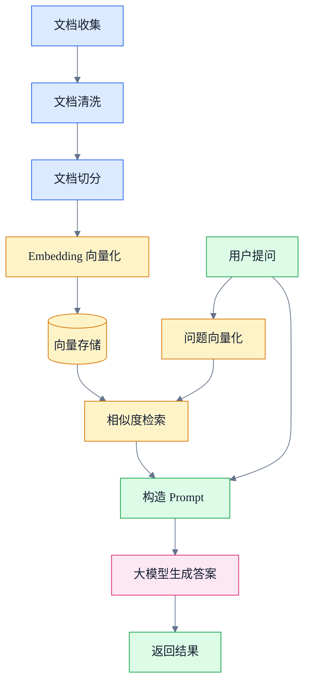

## 什么是RAG？
RAG，全称 Retrieval-Augmented Generation，即“检索增强生成”。它是一种将信息检索与大语言模型生成能力结合起来的技术方案。

传统大语言模型主要依赖训练阶段学到的知识来回答问题，但模型知识存在以下局限：

- 知识可能过时
- 无法直接访问企业内部文档
- 容易产生幻觉
- 对专业领域知识掌握不充分
- 难以追溯答案来源

RAG 的核心思想是：在生成答案之前，先从外部知识库中检索相关资料，再把检索到的内容作为上下文提供给大语言模型，让模型基于这些资料生成答案。

简单来说：

> RAG = 检索系统 + 大语言模型

## RAG使用场景与局限

RAG 适合用于需要结合外部知识进行回答的场景，尤其适合企业知识库问答、智能客服、文档搜索、专业领域问答、代码助手和个人知识管理等方向。

### 使用场景

- 企业知识库问答  
    可以把产品文档、制度文件、技术文档等资料接入 RAG 系统，让用户通过自然语言提问快速获取答案。
    
- 智能客服  
    RAG 可以根据产品说明、常见问题和历史资料，生成更准确的客服回复。
    
- 文档搜索与总结  
    RAG 可以帮助用户从大量文档中快速找到相关内容，并进行整理和总结。
    
- 专业领域问答  
    在法律、医疗、金融、教育等专业场景中，RAG 可以结合领域资料生成更有依据的回答。
    
- 代码助手  
    RAG 可以结合项目文档、API 文档或代码仓库，辅助开发者理解代码和解决问题。
    
- 个人知识管理  
    RAG 可以结合个人笔记内容进行检索和问答，帮助用户更高效地利用自己的知识库。
### 优势

RAG 的优势在于可以让大语言模型利用外部知识库中的最新资料和私有资料，减少只依赖模型训练知识带来的局限。相比直接让大模型回答问题，RAG 可以提高答案的可追溯性，也能在一定程度上减少模型幻觉。
### 局限

RAG 也存在一些局限：

- 依赖知识库质量  
    如果文档内容不完整、不准确或过时，生成的答案也可能受到影响。
    
- 检索结果可能不准确  
    如果系统没有找到真正相关的资料，大模型可能会基于错误上下文生成不理想的答案。
    
- 受到上下文长度限制  
    RAG 无法一次性把所有资料都提供给模型，只能选取部分相关内容作为上下文。
    
- 仍然可能产生幻觉  
    即使使用了 RAG，大模型也仍然可能生成不准确的内容。
    
- 需要额外机制保障准确性  
    在高准确性场景中，通常还需要结合引用来源、权限控制、人工审核和结果校验等机制。
## RAG基本流程
一个典型的 RAG 系统通常包含以下几个步骤：
- 文档收集
- 文档清洗
- 文档切分
- Embedding向量化
- 向量存储
- 用户提问
- 问题向量化
- 相似度检索
- 构造 Prompt
- 大模型生成答案
- 返回结果
流程图

简单来说： 问问题-->找资料-->把问题和资料一起扔给模型-->生成答案
